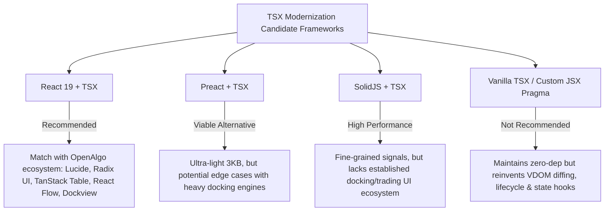
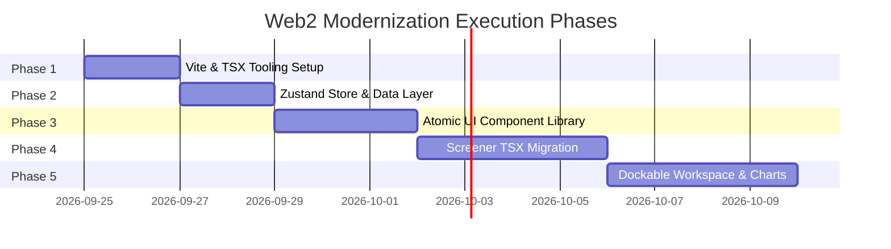

# Honba Web2: Modular TSX Modernization & OpenAlgo Evaluation Plan

## 1. Executive Summary & Current State Analysis

The current `web2/` application is structured as a multi-page Vite project implemented in vanilla TypeScript classes (`ScreenerApp`, `ScreenerTable`, `FilterBar`, `SymbolDetailDrawer`, etc.). While functional, several technical bottlenecks impede scalability and maintainability:

| Dimension | Current Vanilla TS State (`web2`) | Target Modern State |
| :--- | :--- | :--- |
| **Markup & Templating** | Imperative `element.innerHTML = \`...\`` string templates. No compile-time validation for HTML tags, attributes, or event bindings. | **Declarative TSX**: Fully type-checked JSX syntax, compile-time prop validation, declarative event binding. |
| **Component Granularity** | Monolithic files (e.g., `symbol-detail-drawer.ts` is 37KB, `filter-bar.ts` is 29KB, `screener-table.ts` is 26KB). | **Atomic & Modular**: Single-responsibility components (< 120 lines each) categorized into `ui/`, `layout/`, and `features/`. |
| **DOM & Lifecycle** | Manual DOM query selectors (`querySelector`), manual event listener tracking, full-block HTML replacements that drop focus and reset scroll states. | **Managed Lifecycle & VDOM/Reactivity**: Automatic cleanup on unmount, virtualized DOM diffing, persistent focus and scroll states. |
| **Dockable Layouts** | Fixed flexbox layout in `index.html`. Does not yet fulfill `Design.md`'s requirement: *"Components in a window is Selectable and dockable in layout."* | **Dockable Panel Architecture**: Resizable, dockable, and tabbed panels using `react-resizable-panels` or `dockview`. |
| **State Management** | Hand-rolled pub/sub pattern in `dataLayer` triggering full component re-renders. | **Reactive Store (Zustand v5)**: Granular subscriptions (e.g., live tick flashes update only the affected cell, not the whole table). |
| **Icons & Assets** | Hundreds of lines of inline SVG string literals duplicated across components. | **Centralized Icon Registry**: Standardized icons via `lucide-react`. |

---

## 2. OpenAlgo Ecosystem Research & Considerations

An analysis of the **OpenAlgo** ecosystem ([@marketcalls](https://github.com/marketcalls)) reveals a mature, production-grade architecture that directly addresses the challenges faced by `web2`:

### Primary OpenAlgo Repositories Evaluated

1. **[`marketcalls/openalgo`](https://github.com/marketcalls/openalgo)** — Core Platform
   - **Frontend Stack**: React 19, TypeScript (TSX), Vite 8, Tailwind CSS v4, Biome, Vitest, Playwright.
   - **State Management**: **Zustand v5** for app/market state, **TanStack Query v5** for server caching, Socket.IO for real-time streaming.
   - **UI System**: Radix UI headless primitives + Tailwind CSS (shadcn/ui pattern) + Lucide React icons + Sonner toast notifications + `cmdk` command palette.
   - **Dockable Panels**: [`react-resizable-panels`](https://github.com/bvaughn/react-resizable-panels) for split-screen trading layouts.
   - **Node Strategy Builder**: [`@xyflow/react`](https://reactflow.dev/) (React Flow) for visual strategy pipelines (relevant to `AlgoDesigner`).
   - **Script / Code Editor**: [`@uiw/react-codemirror`](https://uiwjs.github.io/react-codemirror) with Python and JSON language packages.

2. **[`marketcalls/openalgo-charts`](https://github.com/marketcalls/openalgo-charts)** — High-Performance Canvas Chart Engine
   - **License**: Apache-2.0, zero runtime dependencies.
   - **Engine**: Single-canvas 2D / WebGL2 rendering pipeline (bypasses DOM-per-bar and SVG overhead).
   - **Market Timing**: Gapless time axis natively collapsing non-trading hours, weekends, and NSE/BSE holidays.
   - **Extensibility**: Descriptors and registries for custom indicators, overlays, and drawing tools.
   - **Terminal Shell**: Ships with complete reference terminal shells (symbol search, interval pills, indicator dropdowns, drawing rail, layout persistence).

3. **[`marketcalls/openalgo-js-indicator-library`](https://github.com/marketcalls/openalgo-js-indicator-library)** — Indicator Library
   - 497 chart indicators ported from Pine Script onto the `openalgo-charts` contract in plain JS/TS.

4. **[`marketcalls/openscript`](https://github.com/marketcalls/openscript)** — Open Trading Language
   - Sandboxed, memory-bounded domain-specific language for compiling and executing indicators and strategies in-browser or on-server.

5. **[`marketcalls/upstox-visualizer`](https://github.com/marketcalls/upstox-visualizer)** — Terminal Reference
   - Demonstrates React + `openalgo-charts` integration with SQLite ingestion of 125,000+ Indian equity and derivatives instruments.

6. **[`marketcalls/openstatz`](https://github.com/marketcalls/openstatz)** — Quant Tearsheets
   - Portfolio analytics, risk metrics, and drawdown distributions (relevant to `Simulator` and `Researcher`).

---

## 3. Technology Evaluation: Selecting TSX

We evaluated four candidate TSX architectures for `web2`:



### Recommendation: **React 19 + TSX with Vite**
- **Ecosystem Parity**: Enables direct reuse of patterns from OpenAlgo (`react-resizable-panels`, `openalgo-charts`, `@xyflow/react`).
- **High-Performance Grid**: Direct integration with **TanStack Table v8** and **TanStack Virtual** for smoothly rendering 5,000+ stock rows at 60fps.
- **Dockable Paneling**: Supports either `react-resizable-panels` (simpler, proven in OpenAlgo) or `dockview` (TradingView-style multi-dock tabbed windows).
- **Fine-Grained Reactivity**: Combined with **Zustand v5**, state selectors prevent re-rendering unaffected components during high-frequency market ticks.

---

## 4. Target Architecture & Directory Structure

```text
web2/
├── src/
│   ├── assets/                      # Global icons, SVG assets
│   ├── core/                        # Data layer & headless business logic
│   │   ├── market-data.ts           # Instrument definitions, mock/live feeds
│   │   ├── data-layer.ts            # WebSocket/REST connection client
│   │   ├── theme-engine.ts          # CSS variable and typography token manager
│   │   └── store/                   # Zustand reactive stores
│   │       ├── use-market-store.ts  # Instruments, active country, live ticks
│   │       ├── use-filter-store.ts  # Active filter criteria, range bounds
│   │       ├── use-layout-store.ts  # Docking layouts, panel states, persistence
│   │       └── use-theme-store.ts   # Dark/light theme, typography selection
│   ├── components/
│   │   ├── ui/                      # Design-system atomic primitives (Reusable)
│   │   │   ├── button.tsx           # Primary, ghost, icon, split buttons
│   │   │   ├── badge.tsx            # Bullish, bearish, neutral status tags
│   │   │   ├── dropdown.tsx         # Popover menus, custom select pickers
│   │   │   ├── modal.tsx            # Accessible dialog backdrop & container
│   │   │   ├── tabs.tsx             # Segmented pill tabs & switcher
│   │   │   ├── sparkline.tsx        # High-performance SVG sparkline
│   │   │   ├── technicals-gauge.tsx # Speedometer gauge for technical scores
│   │   │   └── range-bar.tsx        # 52-Week Price Range visualization
│   │   ├── layout/                  # Shell & docking infrastructure
│   │   │   ├── app-nav.tsx          # Top navigation, app launcher, market selector
│   │   │   ├── bottom-bar.tsx       # Bottom dock tabs, market clock, telemetry
│   │   │   ├── dock-workspace.tsx   # Dockable / resizable panel host
│   │   │   └── floating-action-bar.tsx # Batch row selection toolbar
│   │   └── features/                # App-specific feature modules
│   │       ├── screener/
│   │       │   ├── screener-table.tsx       # Virtualized grid using TanStack Table
│   │       │   ├── filter-bar.tsx           # Category tabs, filter knobs, chips
│   │       │   ├── column-modal.tsx         # Column customizer and reordering
│   │       │   ├── filters-modal.tsx        # Comprehensive multi-tab filter dialog
│   │       │   └── symbol-detail-drawer.tsx # Overview, technicals, key ratios
│   │       ├── workbench/           # Multi-chart workspace (`openalgo-charts`)
│   │       ├── algodesigner/        # Node-based strategy editor (`@xyflow/react`)
│   │       ├── simulator/           # Nautilus backtest runs, equity curves
│   │       └── researcher/          # Quantitative tearsheets & notebooks
│   ├── styles/
│   │   ├── tokens.css               # Design tokens (colors, radii, spacing)
│   │   ├── base.css                 # Base resets, typography, scrollbars
│   │   └── theme.css                # TradingView dark/light, Honba terminal themes
│   ├── apps/                        # Multi-page application root entrypoints
│   │   ├── screener.tsx             # Screener app entrypoint
│   │   ├── workbench.tsx            # WorkBench entrypoint
│   │   ├── algodesigner.tsx         # AlgoDesigner entrypoint
│   │   ├── simulator.tsx            # Simulator entrypoint
│   │   └── researcher.tsx           # Researcher entrypoint
├── index.html
├── workbench.html
├── algodesigner.html
├── simulator.html
├── researcher.html
├── package.json
├── tsconfig.json
└── vite.config.ts
```

---

## 5. Deconstruction of Legacy Monoliths

| Existing Vanilla File | Size | Planned Modular TSX Components |
| :--- | :--- | :--- |
| `src/components/symbol-detail-drawer.ts` | 37 KB | `<SymbolHeader />`, `<TechnicalsGauge />`, `<TechnicalsBreakdown />`, `<KeyStatsGrid />`, `<PerformanceHeatmap />`, `<SymbolDetailDrawer />` |
| `src/components/screener-table.ts` | 26 KB | `<ScreenerTable />` (TanStack Table), `<VirtualRowRenderer />` (TanStack Virtual), `<SymbolCell />`, `<SparklineCell />`, `<Range52Cell />` |
| `src/components/filter-bar.ts` | 29 KB | `<FilterCategoryTabs />`, `<FilterKnobDropdown />`, `<ActiveFilterChips />`, `<FilterBar />` |
| `src/components/tradingview-filters-modal.ts` | 21 KB | `<FiltersModalHeader />`, `<FiltersCategorySidebar />`, `<ConditionRow />`, `<TradingViewFiltersModal />` |
| `src/components/app-nav.ts` | 12 KB | `<AppSwitcherMenu />`, `<SymbolSearchTypeahead />`, `<MarketSelector />`, `<AppNav />` |
| `src/components/bottom-bar.ts` | 3.6 KB | `<AppDockTabs />`, `<MarketStatusItem />`, `<LatencyBadge />`, `<LiveClock />`, `<BottomBar />` |

---

## 6. Layout Customization & Docking Strategy

To satisfy the core requirement in `Design.md` (*"Components in a window is Selectable and dockable in layout. Default layout may be different for different apps."*):

1. **Panel Abstraction**:
   - Every major view is wrapped as a dockable component (`ScreenerTablePanel`, `SymbolDetailPanel`, `ChartPanel`, `FilterPanel`).
2. **Docking Engine (`react-resizable-panels` / `dockview`)**:
   - Supports drag-and-drop docking, horizontal/vertical splits, and tabbed grouping.
3. **Layout Serialization & Presets**:
   - `useLayoutStore` persists layout configuration to `localStorage` per `appId`.
   - Default layout presets:
     - **Default Screener**: Table (70%), Detail Drawer (30%).
     - **Split Screener**: Table top (50%), Comparison Chart bottom (50%).
     - **Focus Mode**: Full-width Table, Drawer floating or collapsed.
   - Built-in *"Reset Layout to Default"* button.

---

## 7. Phased Implementation Roadmap



### Phase 1: Tooling & TSX Foundation Setup
- Install `@vitejs/plugin-react`, `react`, `react-dom`, `@types/react`, `@types/react-dom`.
- Install core utilities: `zustand`, `clsx`, `lucide-react`.
- Configure `vite.config.ts` and `tsconfig.json` (`jsx: "react-jsx"`).
- Verify hot-module replacement (HMR) across multi-page entrypoints.

### Phase 2: State Layer Modernization (`src/core/store/`)
- Wrap `dataLayer` into reactive Zustand stores (`useMarketStore`, `useFilterStore`, `useThemeStore`).
- Implement fine-grained selector hooks to prevent unnecessary re-renders on price ticks.
- Maintain backward-compatible listeners during migration.

### Phase 3: Atomic UI Component Library (`src/components/ui/`)
- Build base design system primitives (`Button`, `Badge`, `Tabs`, `Dropdown`, `Modal`).
- Implement financial data visualizers (`Sparkline`, `TechnicalsGauge`, `RangeBar`).
- Standardize all styling tokens on existing CSS variables (`--bg-primary`, `--border-subtle`, `--bullish`, `--bearish`).

### Phase 4: Screener Feature Migration to TSX
- Convert `AppNav` and `BottomBar` to declarative TSX with reactive clocks and live telemetry.
- Migrate `FilterBar` and `TradingViewFiltersModal` with declarative state binding.
- Rebuild `ScreenerTable` using TanStack Table v8 and TanStack Virtual.
- Break down `SymbolDetailDrawer` into modular sub-components.

### Phase 5: Dockable Workspace & OpenAlgo Cross-App Integration
- Implement `<DockWorkspace />` for flexible split/dock layouts across all five apps.
- Integrate `openalgo-charts` into `WorkBench` (`workbench.html`) and the Screener detail drawer.
- Integrate `@xyflow/react` and CodeMirror into `AlgoDesigner` (`algodesigner.html`).
- Integrate portfolio tearsheets (`openstatz` pattern) into `Simulator` and `Researcher`.
